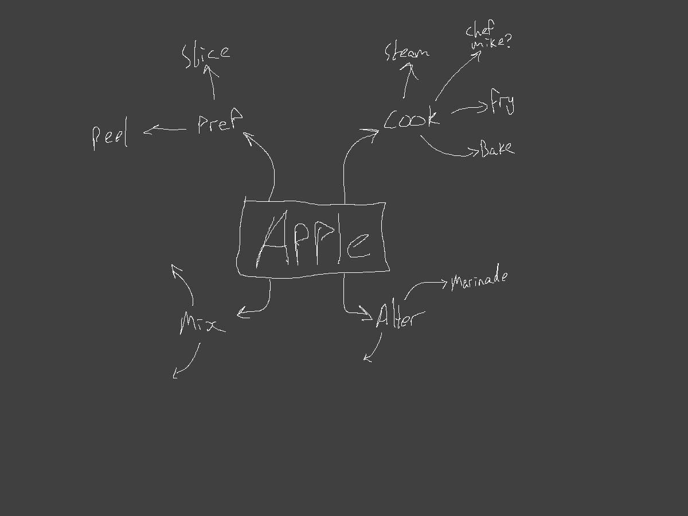
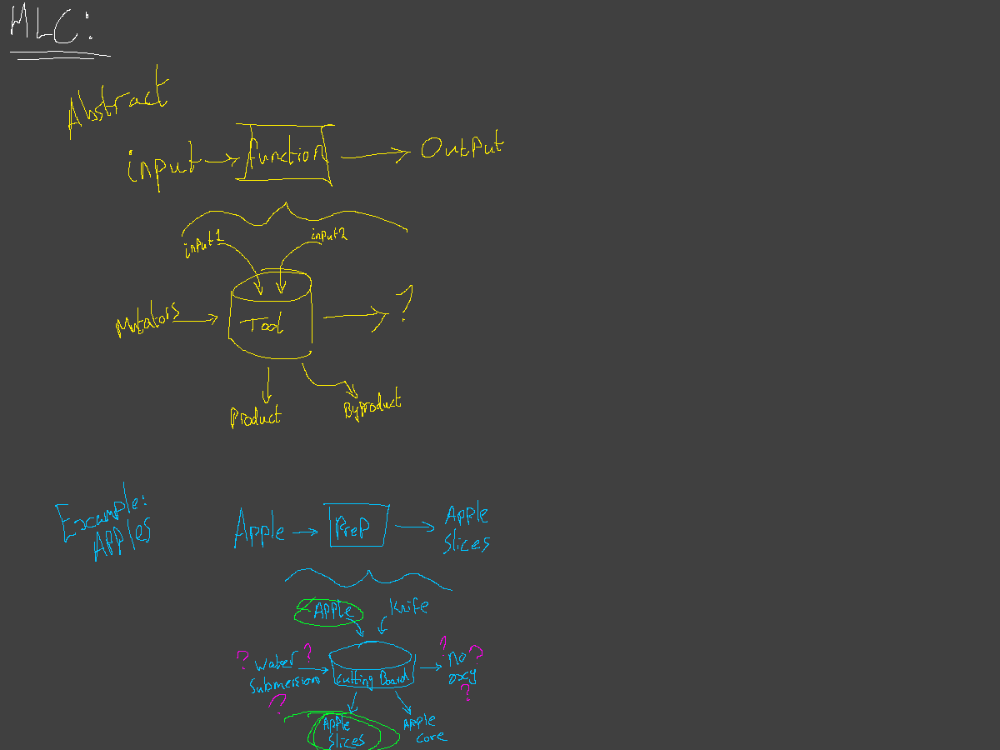

# THE PLAN

This mod is meant to be a pile of miscellaneous features and stuff I want to experiment with to practice Minecraft modding. It might one day have a more coherent purpose, but it's just gonna be this for now.

## Modules

The mod will be split into modules that provide specific features to Minecraft.

### Food

I've always loved mods that make things needlessly complicated. So, why not food?

